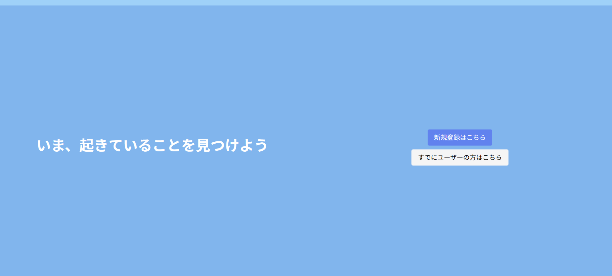
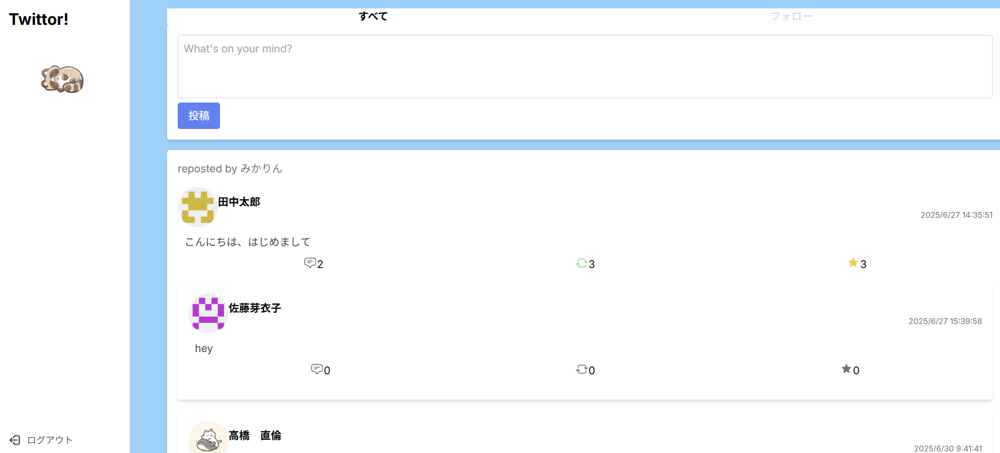

# SNS アプリ（Next.js + Supabase）

## 📌 概要

Twitter 風の SNS アプリです。ユーザー登録後、投稿・リツイート・いいね・リプライなどの基本的な SNS 機能を利用できます。

## 🌐 デモ URL

本アプリは以下で公開されています：

🔗 [https://nextjs-sns-app.vercel.app/](https://nextjs-sns-app.vercel.app/)

---

## 🚀 使用技術

- フロントエンド: Next.js / TypeScript / Tailwind CSS
- バックエンド: Express / Prisma / PostgreSQL（Supabase）
- 認証: JSON Web Token（JWT）+ Cookie
- その他: Axios, React Context, Jest, Testing Library

## 🧩 実装機能

| 機能            | 説明                                                   |
| --------------- | ------------------------------------------------------ |
| 📝 投稿         | テキスト投稿（リプライ、画像は未対応）                 |
| 🔁 リツイート   | 他ユーザーの投稿をリツイートしたり解除することができる |
| ❤️ いいね       | 投稿に対していいねを付けたり解除することができる       |
| 💬 リプライ     | 投稿にリプライでき、スレッド表示される                 |
| 🏠 タイムライン | 「全投稿」と「フォロー中のみ」切り替え表示             |
| 🙍‍♀️ プロフィール | ユーザーごとのプロフィールページ（投稿一覧付き）       |
| 🔐 認証機能     | サインアップ / ログイン / ログアウト                   |

## 🖼 画面イメージ

- トップページ（未ログイン時）
  
- タイムライン画面
  

## 🧪 テスト

本アプリでは Jest + React Testing Library を用いたユニットテストを導入しています。API 通信は `__mocks__/apiClient.ts` にてモック化されています。

### 📁 モック構成例

```ts
// __mocks__/apiClient.ts
const mockApiClient = {
  get: jest.fn().mockResolvedValue({ ... }),
  post: jest.fn().mockResolvedValue({ ... }),
};
export default mockApiClient;
```
